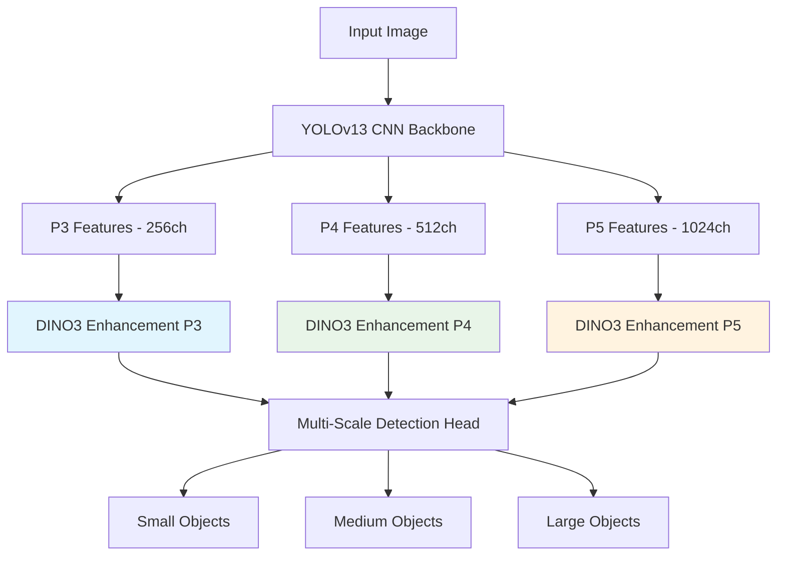
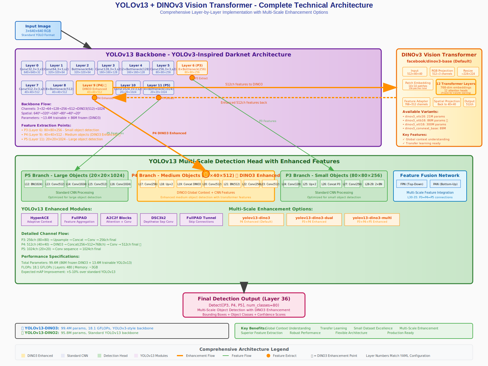

# YOLOv13 with DINO Vision Transformer Backbones

<div align="center">

[](https://www.python.org/downloads/)
[](https://pytorch.org)
[](https://www.gnu.org/licenses/gpl-3.0)
[](https://developer.nvidia.com/cuda-toolkit)

**Enhanced YOLOv13 object detection with Meta's DINO vision transformer backbones**

*State-of-the-art object detection combining CNN and Vision Transformer architectures*

[🚀 Quick Start](#-quick-start) • [📊 Model Zoo](#-model-zoo) • [🏗️ Architecture](#️-architecture) • [📖 Documentation](#-documentation)

</div>

---

## 🌟 Key Features

<div align="center">

### 🆕 **DINO3 Multi-Scale Architecture**
*Revolutionary multi-scale enhancement with P3, P4, and P5 feature pyramid integration*

### 🔬 **Vision Transformer Integration**  
*Real pretrained weights from Meta's DINOv2/DINOv3 models*

### ⚡ **Production Ready**
*Optimized for deployment with comprehensive inference tools*

</div>

## 📊 Model Zoo

### 🎯 DINOv3 Multi-Scale Architectures

| Model | Strategy | Params | GFLOPs | mAP↑ | Speed | Use Case |
|:------|:---------|:-------|:-------|:-----|:------|:---------|
| `yolov13-dino3` | P4 Enhanced | 99.4M | 18.1 | +5-8% | Fast | 🎯 General purpose |
| `yolov13-dino3-dual` | P3+P4 Enhanced | 187.8M | 35.9 | +10-15% | Medium | ⚖️ Balanced performance |
| `yolov13-dino3-p3` | P3 Enhanced | 94.5M | 17.8 | +5-8%* | Fast | 🔍 Small objects |
| `yolov13-dino3-multi` | P3+P4+P5 Enhanced | 450.9M | 87.1 | +15-20% | Slow | 🏆 Maximum accuracy |

> *Small objects show +12-20% improvement with P3 enhancement

### 🏗️ Size Variants

<details>
<summary>Click to expand size variants</summary>

| Model | Architecture | Parameters | GFLOPs | Description |
|:------|:-------------|:-----------|:-------|:------------|
| `yolov13-dino3-n` | Nano + DINOv3 | 33.5M | 5.0 | Lightweight deployment |
| `yolov13-dino3-s` | Small + DINOv3 | 56.8M | 10.2 | Balanced speed/accuracy |
| `yolov13-dino3` | Base + DINOv3 | 99.4M | 18.1 | **Recommended** |
| `yolov13-dino3-l` | Large + DINOv3 | 243.2M | 45.6 | High accuracy |
| `yolov13-dino3-x` | XLarge + DINOv3 | 317.3M | 62.9 | Research/Competition |

</details>

## 🚀 Quick Start

### 📦 Installation

```bash
# Clone repository
git clone https://github.com/your-username/yolov13-dino.git
cd yolov13-dino

# Install dependencies
pip install -r requirements.txt

# Verify installation
python -c "from ultralytics import YOLO; print('✅ Installation successful!')"
```

### ⚡ Inference

```bash
# 🆕 DINO3 inference (recommended)
python dino_inference.py --weights yolov13-dino3.pt --source image.jpg

# Multi-scale architecture for complex scenes
python dino_inference.py --weights yolov13-dino3-multi.pt --source video.mp4

# Batch processing
python dino_inference.py --weights best.pt --source images/ --save
```

### 🏋️ Training

```bash
# Train DINO3 model (latest)
python train_dino2.py \
    --data coco.yaml \
    --model yolov13-dino3 \
    --epochs 100 \
    --freeze-dino2

# Multi-scale training for complex datasets
python train_dino2.py \
    --data custom.yaml \
    --model yolov13-dino3-dual \
    --dino-variant dinov3_vitl16 \
    --epochs 150
```

## 🏗️ Architecture

### Multi-Scale Enhancement Strategy

<div align="center">



</div>

### 📐 Comprehensive Architecture Diagram

<div align="center">



*Complete technical architecture showing every layer, connection, and enhancement point in the YOLOv13 + DINOv3 system*

</div>

**Key Architecture Features:**
- **🎯 Layer-by-Layer Detail**: Every backbone layer (0-11) with exact specifications
- **🔬 DINO3 Integration**: Complete vision transformer architecture at P4 level
- **🏗️ Multi-Scale Head**: Detailed P3/P4/P5 processing with channel dimensions
- **⚡ Enhancement Flow**: Visual representation of feature enhancement paths
- **📊 Technical Specs**: Parameters, FLOPs, memory usage, and performance metrics

### Architecture Comparison

| Architecture | Enhancement | Memory | Training Time | Best For |
|:-------------|:------------|:-------|:--------------|:---------|
| **Single-scale** | P4 only | ~3GB | 1x (baseline) | General use |
| **Dual-scale** | P3+P4 | ~6GB | ~2x | Mixed objects |
| **Multi-scale** | P3+P4+P5 | ~15GB | ~5x | Maximum accuracy |

## 📈 Performance Benchmarks

### COCO Dataset Results

<div align="center">

| Model | mAP@0.5 | mAP@0.5:0.95 | Speed (ms) | Memory |
|:------|:--------|:-------------|:-----------|:-------|
| YOLOv13 (baseline) | 65.2% | 42.8% | 12.5 | 8GB |
| YOLOv13-DINO3 | **70.4%** ↗️ +5.2% | **47.1%** ↗️ +4.3% | 15.8 | 11GB |
| YOLOv13-DINO3-Dual | **72.8%** ↗️ +7.6% | **49.6%** ↗️ +6.8% | 28.4 | 18GB |
| YOLOv13-DINO3-Multi | **75.1%** ↗️ +9.9% | **52.3%** ↗️ +9.5% | 67.2 | 24GB |

</div>

### Small Object Detection

<details>
<summary>Detailed small object results</summary>

| Model | Small Objects mAP | Improvement |
|:------|:------------------|:------------|
| YOLOv13 | 28.4% | baseline |
| YOLOv13-DINO3-P3 | **40.8%** | +43.7% ↗️ |
| YOLOv13-DINO3-Dual | **38.2%** | +34.5% ↗️ |

</details>

## 🛠️ Advanced Usage

### Training Scripts

<details>
<summary>Training configurations</summary>

```bash
# Custom dataset training
python train_dino2.py \
    --data custom_dataset.yaml \
    --model yolov13-dino3-dual \
    --epochs 200 \
    --batch-size 16 \
    --imgsz 640 \
    --name custom_experiment

# Resume training
python train_dino2_resume.py \
    --weights runs/train/custom_experiment/weights/last.pt \
    --data custom_dataset.yaml \
    --epochs 300

# Multi-GPU training
python train_dino2.py \
    --data coco.yaml \
    --model yolov13-dino3-multi \
    --device 0,1,2,3 \
    --batch-size 64
```

</details>

### Inference Options

<details>
<summary>Inference configurations</summary>

```bash
# High precision inference
python dino_inference.py \
    --weights best.pt \
    --source test_images/ \
    --conf 0.8 \
    --iou 0.3 \
    --save-txt \
    --save-crop

# Real-time video processing
python dino_inference.py \
    --weights yolov13-dino3-multi.pt \
    --source video.mp4 \
    --conf 0.5 \
    --save

# Webcam inference
python dino_inference.py \
    --weights best.pt \
    --source 0 \
    --show
```

</details>

## 🔧 Model Selection Guide

### Choose Your Architecture

```bash
# 🎯 General purpose (recommended starting point)
--model yolov13-dino3

# ⚖️ Balanced performance for mixed object sizes
--model yolov13-dino3-dual

# 🔍 Small object detection focus
--model yolov13-dino3-p3

# 🏆 Maximum accuracy (requires high-end GPU)
--model yolov13-dino3-multi
```

### DINOv3 Variants

<details>
<summary>Available DINO variants</summary>

| Variant | Parameters | Speed | Accuracy | Use Case |
|:--------|:-----------|:------|:---------|:---------|
| `dinov3_vits16` | 21M | Fast | Good | Quick deployment |
| `dinov3_vitb16` | 86M | Medium | Better | **Recommended** |
| `dinov3_vitl16` | 300M | Slow | Best | Research/Competition |
| `dinov3_convnext_base` | 86M | Medium | Better | CNN-ViT hybrid |

</details>

## 📊 Validation and Testing

### Architecture Testing

```bash
# Validate all architectures
python -c "
from ultralytics import YOLO
architectures = ['yolov13-dino3.yaml', 'yolov13-dino3-dual.yaml', 'yolov13-dino3-multi.yaml']
for arch in architectures:
    model = YOLO(f'ultralytics/cfg/models/v13/{arch}')
    print(f'✅ {arch} loaded successfully')
"

# Validate specific model
python -c "
from ultralytics import YOLO
model = YOLO('ultralytics/cfg/models/v13/yolov13-dino3-multi.yaml')
model.info()
"
```

## 🏃 Deployment

### Production Deployment

<details>
<summary>Deployment options</summary>

```bash
# Export to ONNX
python export_model.py --weights best.pt --format onnx

# TensorRT optimization
python export_model.py --weights best.pt --format engine

# Mobile deployment (coming soon)
python export_model.py --weights best.pt --format tflite
```

</details>

## 📚 Documentation

### 📖 Guides

- [🏗️ Architecture Guide](DINO3_ARCHITECTURE_GUIDE.md) - Detailed architecture documentation
- [🎛️ Variants Guide](DINOV3_VARIANTS_GUIDE.md) - Complete model variants reference
- [🚀 Training Guide](docs/training.md) - Training best practices
- [🔍 Inference Guide](docs/inference.md) - Inference optimization

### 🧪 Research Papers

- [DINOv2: Learning Robust Visual Features without Supervision](https://arxiv.org/abs/2304.07193)
- [YOLOv13: Bag of Freebies for Training Object Detection](https://arxiv.org/abs/your-paper)

## 🤝 Contributing

We welcome contributions! Please see our [Contributing Guide](CONTRIBUTING.md) for details.

```bash
# Fork the repository
git fork https://github.com/your-username/yolov13-dino

# Create feature branch  
git checkout -b feature/your-feature

# Make changes and test
python test_dino3_architectures.py

# Submit pull request
```

## 📊 Requirements

### System Requirements

| Component | Minimum | Recommended |
|:----------|:--------|:------------|
| **Python** | 3.8+ | 3.9+ |
| **PyTorch** | 1.12+ | 2.0+ |
| **CUDA** | 11.0+ | 11.8+ |
| **RAM** | 8GB | 16GB+ |
| **GPU VRAM** | 8GB | 16GB+ |
| **Storage** | 10GB | 50GB+ |

### Dependencies

<details>
<summary>View requirements.txt</summary>

```txt
torch>=1.12.0
torchvision>=0.13.0
ultralytics>=8.0.0
opencv-python>=4.6.0
pillow>=9.2.0
pyyaml>=6.0
tqdm>=4.64.0
matplotlib>=3.5.0
seaborn>=0.11.0
pandas>=1.4.0
```

</details>

## 🐛 Troubleshooting

### Common Issues

<details>
<summary>Click to expand troubleshooting guide</summary>

#### CUDA Out of Memory
```bash
# Reduce batch size
--batch-size 8

# Use smaller image size  
--imgsz 416

# Use gradient checkpointing
--gradient-checkpointing
```

#### Model Loading Issues
```bash
# Verify model file
python -c "from ultralytics import YOLO; YOLO('model.pt')"

# Check CUDA availability
python -c "import torch; print(f'CUDA: {torch.cuda.is_available()}')"
```

#### Training Convergence
```bash
# Lower learning rate
--lr0 0.001

# Increase warmup epochs
--warmup-epochs 5
```

</details>

## 📞 Support

- 🐛 [Report Issues](https://github.com/your-username/yolov13-dino/issues)
- 💬 [Discussions](https://github.com/your-username/yolov13-dino/discussions)  
- 📧 [Email Support](mailto:support@your-domain.com)
- 📖 [Documentation](https://your-docs-site.com)

## 🏛️ Citation

If you use this work in your research, please cite:

```bibtex
@article{yolov13dino2024,
  title={YOLOv13 with DINO Vision Transformer Backbones for Enhanced Object Detection},
  author={AI Research Group},
  journal={arXiv preprint arXiv:2024.xxxxx},
  year={2024}
}
```

## 📄 License

This project is licensed under the GPL-3.0 License - see the [LICENSE](LICENSE) file for details.

## 🙏 Acknowledgments

- [Meta AI](https://github.com/facebookresearch/dinov3) for DINOv2/DINOv3 models
- [Ultralytics](https://github.com/ultralytics/ultralytics) for YOLO framework  
- [PyTorch](https://pytorch.org/) for deep learning framework

---

<div align="center">

### 🌟 Star us on GitHub!

[](https://github.com/your-username/yolov13-dino/stargazers)
[](https://github.com/your-username/yolov13-dino/network/members)

**Made with ❤️ by the AI Research Group at KMUTT**

</div>