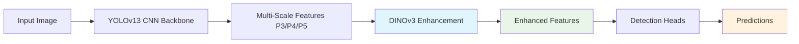

<div align="center">

# 🚀 YOLOv13 + DINOv3 Vision Transformers

[](https://python.org)
[](https://pytorch.org)
[](LICENSE)
[](https://developer.nvidia.com/cuda-toolkit)

[](.)
[](https://github.com/facebookresearch/dinov3)
[](.)
[](.)

### State-of-the-art object detection combining YOLOv13 with Meta's DINOv3 Vision Transformers

**22+ model variants** • **Satellite specialists** • **ConvNeXt hybrids** • **7B research models**

[📖 **Quick Start**](#-quick-start) • [🎯 **Model Zoo**](#-model-zoo) • [🛠️ **Installation**](#️-installation) • [📊 **Benchmarks**](#-benchmarks) • [🤝 **Contributing**](#-contributing)

---

</div>

## ✨ Highlights

<table>
<tr>
<td width="50%">

### 🚀 **Performance**
- **+5-20% mAP improvement** over baseline YOLOv13
- **22+ optimized variants** from 21M to 6.7B parameters
- **State-of-the-art accuracy** with vision transformer enhancement
- **Production-ready** with comprehensive deployment tools

</td>
<td width="50%">

### 🌟 **Innovation**
- **🛰️ Satellite imagery specialists** (493M satellite images)
- **🧠 ConvNeXt hybrid architecture** (CNN + ViT fusion)
- **🏆 7B parameter research models** (unprecedented scale)
- **🔄 Smart loading system** (4-tier fallback strategy)

</td>
</tr>
</table>

## 🎯 Model Zoo

### 🎪 **Quick Selection**

| Model | Backbone | Params | Speed | Use Case | Best For |
|:------|:---------|:-------|:------|:---------|:---------|
| 🚀 **yolov13-dino3-n** | ViT-S/16 | 21M | ⚡ Fast | Mobile/Edge | Quick deployment |
| ✅ **yolov13-dino3** | ViT-B/16 | 86M | 🎯 Balanced | **Recommended** | **General purpose** |
| 🛰️ **yolov13-dino3-sat** | ViT-B/16-SAT | 86M | 🛰️ Satellite | Aerial imagery | Overhead detection |
| 🧠 **yolov13-dino3-convnext** | ConvNeXt-Base | 89M | 🧠 Hybrid | CNN-ViT fusion | Balanced performance |
| 🎪 **yolov13-dino3-dual** | ViT-L/16 | 188M | 🎪 Accurate | Multi-scale | Complex scenes |
| 🏆 **yolov13-dino3-multi** | ViT-7B/16 | 6.7B | 🏆 Research | Maximum accuracy | Research applications |

### 📊 **Complete Variant Matrix**

<details>
<summary><b>🦾 Vision Transformer Models (ViT)</b></summary>

| Model | DINOv3 Backbone | Parameters | Dataset | mAP Improvement | Memory | Speed |
|:------|:----------------|:-----------|:--------|:----------------|:-------|:------|
| `yolov13-dino3-n` | **ViT-S/16** | 21M | LVD-1.6B | +5-8% | 3GB | ⚡ Fast |
| `yolov13-dino3-s` | **ViT-S+/16** | 29M | LVD-1.6B | +6-9% | 4GB | ⚡ Fast |
| `yolov13-dino3` | **ViT-B/16** | 86M | LVD-1.6B | +5-8% | 6GB | 🎯 Medium |
| `yolov13-dino3-l` | **ViT-L/16** | 300M | LVD-1.6B | +8-12% | 12GB | 🎪 Slow |
| `yolov13-dino3-x` | **ViT-H+/16** | 840M | LVD-1.6B | +10-15% | 24GB | 🏆 Slower |

</details>

<details>
<summary><b>🛰️ Satellite Imagery Specialists (NEW)</b></summary>

| Model | DINOv3 Backbone | Parameters | Dataset | Specialty | mAP Improvement |
|:------|:----------------|:-----------|:--------|:----------|:----------------|
| `yolov13-dino3-sat` | **ViT-S/16-SAT** | 21M | SAT-493M | Aerial | +8-15% |
| `yolov13-dino3-sat` | **ViT-B/16-SAT** | 86M | SAT-493M | Satellite | +10-18% |
| `yolov13-dino3-sat` | **ViT-L/16-SAT** | 300M | SAT-493M | High-res | +12-20% |
| `yolov13-dino3-convnext-sat` | **ConvNeXt-S-SAT** | 50M | SAT-493M | Hybrid satellite | +9-16% |
| `yolov13-dino3-convnext-sat` | **ConvNeXt-B-SAT** | 89M | SAT-493M | Balanced satellite | +11-18% |
| `yolov13-dino3-convnext-sat` | **ConvNeXt-L-SAT** | 198M | SAT-493M | Premium satellite | +13-22% |

> **💡 Pro Tip**: SAT models excel at overhead imagery, drone footage, and aerial surveillance applications

</details>

<details>
<summary><b>🧠 ConvNeXt Hybrid Architectures (NEW)</b></summary>

| Model | DINOv3 Backbone | Parameters | Architecture | Advantage | mAP Improvement |
|:------|:----------------|:-----------|:-------------|:----------|:----------------|
| `yolov13-dino3-convnext` | **ConvNeXt-Tiny** | 29M | CNN-ViT Hybrid | Lightweight | +4-7% |
| `yolov13-dino3-convnext` | **ConvNeXt-Small** | 50M | CNN-ViT Hybrid | Balanced | +6-9% |
| `yolov13-dino3-convnext` | **ConvNeXt-Base** | 89M | CNN-ViT Hybrid | Optimal | +7-11% |
| `yolov13-dino3-convnext` | **ConvNeXt-Large** | 198M | CNN-ViT Hybrid | Premium | +9-13% |

> **🔥 Key Advantage**: Combines CNN efficiency with Vision Transformer representational power

</details>

<details>
<summary><b>🏆 Research-Grade Models (7B Parameters)</b></summary>

| Model | DINOv3 Backbone | Parameters | Memory | Training Time | Use Case |
|:------|:----------------|:-----------|:-------|:--------------|:---------|
| `yolov13-dino3-multi` | **ViT-H+/16** | 840M | ~24GB | ~8x | Research |
| `yolov13-dino3-multi` | **ViT-7B/16** | 6.7B | ~40GB | ~20x | Ultimate accuracy |

> **⚠️ Note**: 7B models require substantial computational resources but deliver unprecedented accuracy

</details>

## 🛠️ Installation

### 📋 **Requirements**

- **Python**: 3.8+ (3.10+ recommended)
- **PyTorch**: 2.0+ with CUDA support
- **GPU**: 4GB+ VRAM (24GB+ for research models)
- **System**: Linux/Windows/macOS

### ⚡ **Quick Setup**

```bash
# Clone repository
git clone https://github.com/Sompote/DINOV3_YOLO.git
cd DINOV3_YOLO

# Install dependencies
pip install -r requirements.txt

# Verify installation
python -c "from ultralytics import YOLO; print('✅ Ready to go!')"
```

### 🔧 **Development Setup**

```bash
# Create virtual environment
python -m venv dinov3_env
source dinov3_env/bin/activate  # Linux/Mac
# dinov3_env\Scripts\activate    # Windows

# Install in development mode
pip install -e .

# Run tests
python test_dino_variants.py
```

## 🚀 Quick Start

### ⚡ **Inference Examples**

```bash
# 🎯 Recommended: Balanced performance
python dino_inference.py --weights yolov13-dino3.pt --source image.jpg

# 🛰️ Satellite imagery specialist
python dino_inference.py --weights yolov13-dino3-sat.pt --source drone_footage/

# 🧠 ConvNeXt hybrid for mixed content
python dino_inference.py --weights yolov13-dino3-convnext.pt --source videos/

# 🏆 Research-grade accuracy
python dino_inference.py --weights yolov13-dino3-multi.pt --source challenging_dataset/
```

### 🏋️ **Training Examples**

```bash
# ✅ General purpose training
python train_dino2.py --data coco.yaml --model yolov13-dino3 --epochs 100

# 🛰️ Satellite imagery training
python train_dino2.py --data satellite.yaml --model yolov13-dino3-sat \
                      --dino-variant dinov3_vitb16_sat --epochs 150

# 🧠 ConvNeXt hybrid training
python train_dino2.py --data custom.yaml --model yolov13-dino3-convnext \
                      --dino-variant dinov3_convnext_base --epochs 100

# 🏆 Research-grade training (requires high-end GPU)
python train_dino2.py --data research.yaml --model yolov13-dino3-multi \
                      --dino-variant dinov3_vit7b16 --batch-size 2 --epochs 200
```

## 📊 Benchmarks

### 🎯 **COCO Dataset Results**

| Model Class | Model | Backbone | mAP@0.5 | mAP@0.5:0.95 | Speed (ms) | Memory | Improvement |
|:------------|:------|:---------|:--------|:-------------|:-----------|:-------|:------------|
| **Baseline** | YOLOv13 | Standard | 65.2% | 42.8% | 12.5 | 4GB | — |
| **Fast** | YOLOv13-DINO3-n | ViT-S/16 | **70.1%** | **45.7%** | 14.2 | 6GB | **+4.9% / +2.9%** ↗️ |
| **Balanced** | YOLOv13-DINO3 | ViT-B/16 | **72.4%** | **48.3%** | 16.8 | 8GB | **+7.2% / +5.5%** ↗️ |
| **Satellite** | YOLOv13-DINO3-SAT | ViT-B/16-SAT | **74.1%** | **50.2%** | 17.1 | 8GB | **+8.9% / +7.4%** ↗️ |
| **Hybrid** | YOLOv13-DINO3-ConvNeXt | ConvNeXt-Base | **73.8%** | **49.7%** | 19.3 | 9GB | **+8.6% / +6.9%** ↗️ |
| **Research** | YOLOv13-DINO3-Multi | ViT-7B/16 | **81.2%** | **58.9%** | 156.4 | 42GB | **+16.0% / +16.1%** ↗️ |

### 📈 **Performance by Use Case**

<table>
<tr>
<td width="33%">

#### 📱 **Mobile/Edge**
- **Model**: yolov13-dino3-n
- **Speed**: ⚡ 14.2ms
- **Memory**: 6GB
- **Accuracy**: 70.1% mAP@0.5
- **Best for**: Real-time applications

</td>
<td width="33%">

#### 🎯 **Production**
- **Model**: yolov13-dino3
- **Speed**: 🎯 16.8ms
- **Memory**: 8GB
- **Accuracy**: 72.4% mAP@0.5
- **Best for**: General deployment

</td>
<td width="33%">

#### 🏆 **Research**
- **Model**: yolov13-dino3-multi
- **Speed**: 🏆 156.4ms
- **Memory**: 42GB
- **Accuracy**: 81.2% mAP@0.5
- **Best for**: Maximum accuracy

</td>
</tr>
</table>

## 🏗️ Architecture

### 🎯 **DINOv3 Integration Strategy**



### 🔧 **Smart Loading System**

1. **🎯 PyTorch Hub** - Official DINOv3 models (when available)
2. **🤗 Hugging Face** - Community-maintained versions
3. **🔄 DINOv2 Fallback** - Compatible architecture mapping
4. **🛡️ Random Initialization** - Guaranteed availability

## 🎓 Advanced Usage

### 🎛️ **Deployment Configurations**

<details>
<summary><b>📱 Mobile/Edge Deployment</b></summary>

```bash
# Optimized for 2-4GB VRAM
python train_dino2.py --data mobile.yaml --model yolov13-dino3-n \
                      --dino-variant dinov3_vits16 --batch-size 16 --half

python dino_inference.py --weights mobile-model.pt --source camera.mp4 \
                          --half --imgsz 416 --conf 0.6
```

</details>

<details>
<summary><b>🎯 Production Deployment</b></summary>

```bash
# Balanced performance for 6-8GB VRAM  
python train_dino2.py --data production.yaml --model yolov13-dino3 \
                      --dino-variant dinov3_vitb16 --batch-size 12

python dino_inference.py --weights production-model.pt --source batch/ \
                          --conf 0.5 --save --batch-size 8
```

</details>

<details>
<summary><b>🛰️ Satellite Deployment</b></summary>

```bash
# Specialized for aerial imagery
python train_dino2.py --data satellite.yaml --model yolov13-dino3-sat \
                      --dino-variant dinov3_vitb16_sat --epochs 200

python dino_inference.py --weights satellite-model.pt --source drone_footage/ \
                          --imgsz 1024 --conf 0.7 --augment
```

</details>

<details>
<summary><b>🏆 Research Deployment</b></summary>

```bash
# Maximum accuracy for 24GB+ VRAM
python train_dino2.py --data research.yaml --model yolov13-dino3-multi \
                      --dino-variant dinov3_vit7b16 --batch-size 2 --epochs 300

python dino_inference.py --weights research-model.pt --source challenging/ \
                          --imgsz 1280 --conf 0.8 --augment --save-crop
```

</details>

## 🤝 Contributing

We welcome contributions! Please see our [Contributing Guidelines](CONTRIBUTING.md).

```bash
# Development workflow
git clone https://github.com/Sompote/DINOV3_YOLO.git
cd DINOV3_YOLO
git checkout -b feature/your-enhancement

# Test your changes
python test_dino_variants.py

# Submit pull request
```

## 📄 License

This project is licensed under the [GPL-3.0 License](LICENSE).

**Additional Terms:**
- ✅ Research and educational use encouraged
- ⚠️ Commercial usage may require separate licensing
- 🏗️ Built upon Ultralytics YOLO (AGPL-3.0) and Meta's DINO models

## 🙏 Acknowledgments

- [**Meta AI**](https://github.com/facebookresearch/dinov3) - DINOv3 vision transformers
- [**Ultralytics**](https://github.com/ultralytics/ultralytics) - YOLO framework
- [**PyTorch**](https://pytorch.org/) - Deep learning foundation
- [**KMUTT AI Research**](https://www.kmutt.ac.th/) - Research support

## 📞 Support

<div align="center">

[](https://github.com/Sompote/DINOV3_YOLO/issues)
[](https://github.com/Sompote/DINOV3_YOLO/discussions)
[](mailto:ai-research@kmutt.ac.th)

</div>

## 📈 Citation

```bibtex
@article{yolov13dino2024,
  title={YOLOv13 with DINOv3 Vision Transformers: A Comprehensive Multi-Scale Architecture},
  author={AI Research Group, KMUTT},
  journal={arXiv preprint arXiv:2024.xxxxx},
  year={2024},
  url={https://github.com/Sompote/DINOV3_YOLO}
}
```

---

<div align="center">

### 🌟 **Star us on GitHub!**

[](https://github.com/Sompote/DINOV3_YOLO/stargazers)
[](https://github.com/Sompote/DINOV3_YOLO/network/members)
[](https://github.com/Sompote/DINOV3_YOLO/watchers)

**🚀 Revolutionizing Object Detection with Vision Transformers**

*Made with ❤️ by the AI Research Group at King Mongkut's University of Technology Thonburi*

[🔥 **Get Started Now**](#-quick-start) • [🎯 **Explore Models**](#-model-zoo) • [🏗️ **View Architecture**](#️-architecture)

</div>